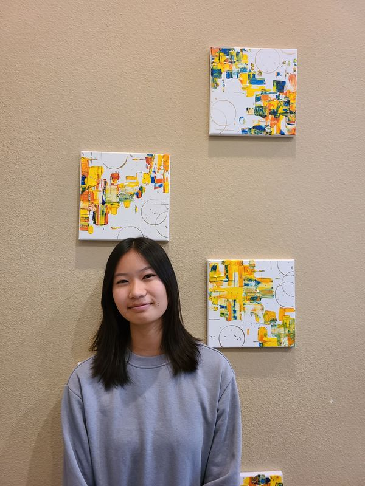

# Catherine Du
Introduction:
>Hello, I'm a 2<sup>nd</sup> year UCSD student studying computer science, with a cognitive science minor.

Some of the language I know are:
```
Java
C
C++
ARM assembly
```

Projects:
1. [User Page](https://github.com/c5du/CSE-110-Projects)
   - Has mutiple pages including this page and [README](README.md)
2. [Markdown Parse](https://github.com/c5du/markdown-parse)

Relevant CourseWork:
- [x] Data Structure
- [x] Discrete Mathmatics
- [x] Software Tools and Techniques Lab
- [x] Design and Analysis of Algorithms/Systems
- [x] Theory of Computation
- [ ] Software Engineering

[Go to the top](#Catherine-Du)